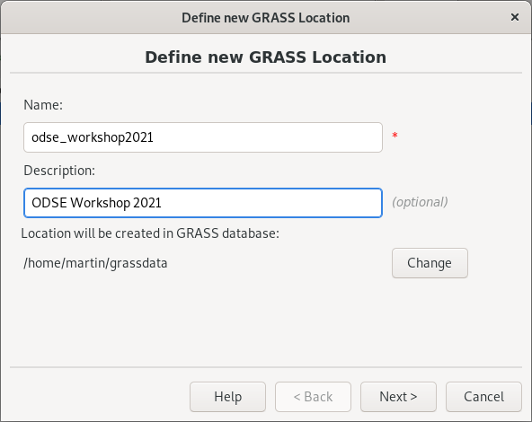

[Part 1] First steps
====================

Starting a GRASS session requires basic knowledge about the software
itself. GRASS motivates users to organize their data from an early
beginning. GRASS uses a consistent structure of so-called
**locations** and **mapsets** to organize its data. This has not 
changed in GRASS 8.

.. _location-mapset-section:

The GRASS data structure has three levels:

#. **Database directory.** A directory on local or network disc which
   contains all data accessed by GRASS. It's usually a directory called
   :file:`grassdata` located in users' home directory. 

#. **Location**. All geodata stored within one location must have the
   same spatial coordinate system (GRASS doesn't support on-the-fly
   projection for several reasons).

#. **Mapset**. Contains task-related data within one project. Helps
   organizing data into logical groups or to separate parallel work of
   different users on the same project.

.. note:: In GRASS 7, a startup screen (:numref:`startup7`) appeared 
   before entering a session. The user had to define the working
   environment in which the GRASS session started. This step 
   was required to enter GRASS. Such an approach is not so
   common. Applications like Esri ArcGIS or QGIS just start. Users
   load different data from various sources in different
   projections and start working on their project.

   .. _startup7:
   
   .. figure:: ../images/units/02/startup-0.png

      GRASS GIS startup screen in version 7.

   
Obstacles (especially for newcomers) related to the startup screen have
been reduced in GRASS 8. The startup screen has been
replaced by a completely new mechanism. On the first launch, GRASS 8 
sets up the *database directory* automatically and launches GUI in a
default location *World LatLong WGS84*. Also, a sample *world* vector
layer (in GRASS terminology *vector map*) is shown.

GRASS GUI is designed as a *simple and lightweight* graphical user
interface. Basically, it is a GUI front-end calling GRASS commands (see
:ref:`grass-modules`) in the background. The GUI consists of two main
windows, see :numref:`startup8`.

.. _startup8:

.. figure:: ../images/units/02/grass8-start.png
   :class: large
           
   GRASS GIS 8 on startup.

.. tip:: If GUI crashes, it can be started again by :grasscmd:`g.gui`
   command from the underlying terminal (command prompt).
         
GRASS GUI guides users by means of tooltips as shown in
:numref:`startup8`. The default location is not designed for real
work. The next step is usually to create new "project(s)" (in GRASS
terminology *a location*) with user-defined spatial coordinate systems.

.. _create-location:

Create a new location
---------------------

By clicking on :item:`Create new Location` button in the tooltip (or by
|grass-location-add| from the toolbar) the wizard appears. A new GRASS
location can be easily created using :wikipedia:`EPSG` codes or
user-defined geodata.

In the first page of the location wizard, the location name is defined. 
Optionally, also a short description can be added.

   Define a name for the new GRASS location. 

In the next page, a coordinate reference system (CRS) is chosen. CRS is
usually defined by EPSG code (:item:`Select CRS from a list by EPSG or
description`) or by user-defined geodata (:item:`Read CRS from a
georeferenced data file`). 

.. figure:: ../images/units/02/create-location-1.png

   Choose CRS for creating a new GRASS location.

In our case, a new location will be created by defining :epsg:`3035`.

   Define CRS by EPSG code.

   After defining EPSG code also datum transformation parameters must
   be defined.

A new GRASS user-defined location will be created by clicking on
:item:`Finish` button.

   Check the summary.

By default GRASS creates a *PERMANENT mapset* in the new location.
Here, all location settings are stored. This mapset is commonly used for
importing input geodata used in the location.

.. figure:: ../images/units/02/create-location-5.png

   GRASS GUI automatically switches to the new location.
