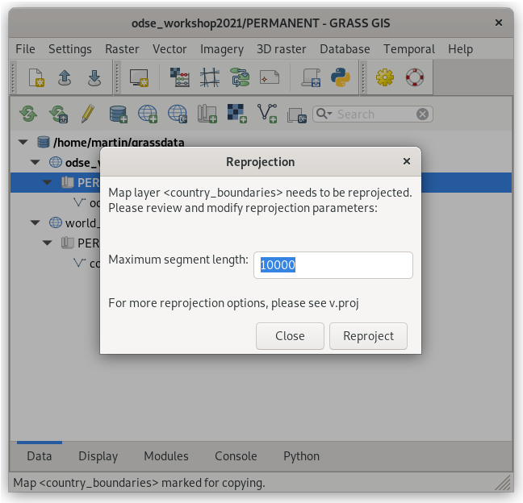
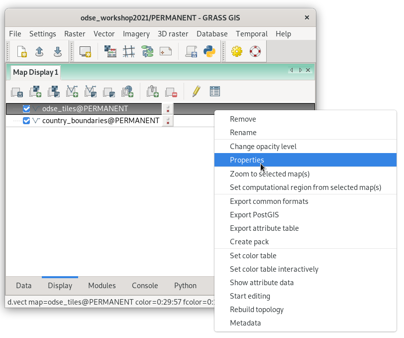
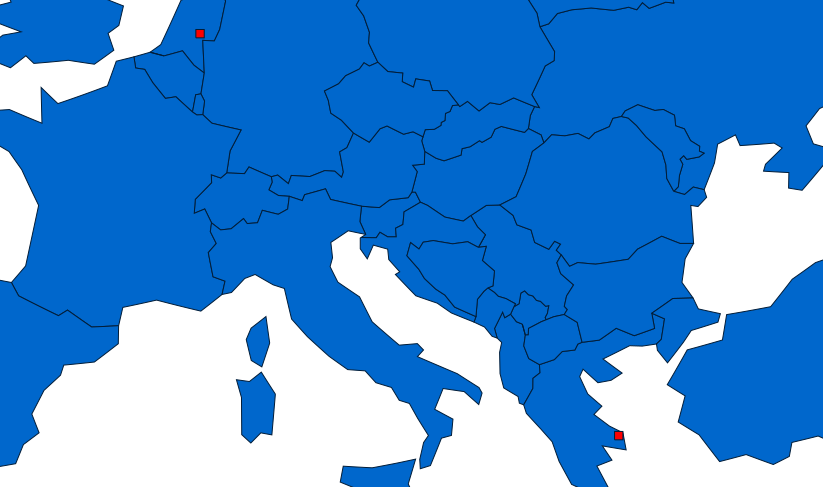
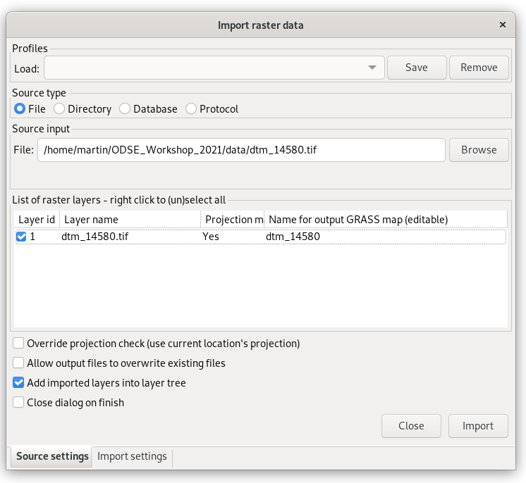
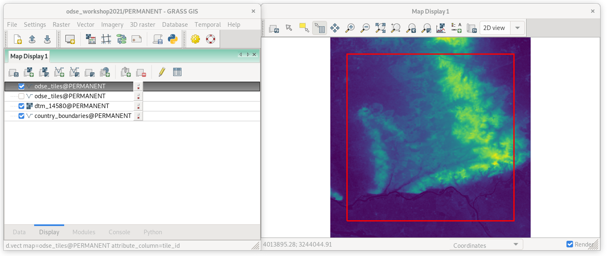

Data Management
===============

Data can be imported simply from toolbar in :item:`Data` tab by tools
dedicated for :wikipedia:`raster <GIS_file_formats#Raster>`
|grass-raster-import| or :wikipedia:`vector <GIS_file_formats#Vector>`
|grass-vector-import| GIS data formats. Basic knowledge of commonly
used :wikipedia:`GIS file formats` is required.

.. note:: GRASS terminology differs from commonly used GIS
   packages. To avoid confusion let's focus on the most
   important terms. Commonly used term "a layer" is called in
   GRASS "a map". While GRASS layer is a subset of features within
   one "map". So "GRASS raster map" can be treated as "a raster
   layer" in other GIS packages.

Vector data
-----------

Let's import sample ODSE tiles (:file:`odse_tiles.gpkg`) vector data
from the toolbar |grass-vector-import| :sup:`Import vector data
[v.import]`.

.. figure:: ../images/units/02/odse_tiles_import.png

   Select input vector file to be imported.
   
.. figure:: ../images/units/02/odse_tiles.png
   :class: large
           
   Imported vector data is automatically displayed in *Map Display*
   window. Progress of import is shown in :item:`Console` tab.

Let's copy into the current location a world map from default location
for better feeling.

.. figure:: ../images/units/02/copy-0.png
               
   Expand *world_latlong_wgs84* location and select
   *country_boundaries* vector map.

.. figure:: ../images/units/02/copy-1.png

   Select the currect location and mapset and paste already selected
   data.

   Coordinate reference system of source (:epsg:`4326`) and target
   (:epsg:`3035`) location is different. GRASS will re-project
   data. Let's keep default value for maximum segment length (10km).

To display copied vector data go to :item:`Data` tab, choose
layer to be displayed and from contextual menu choose
:item:`Display layer` (or use double-click on layer).
   
.. figure:: ../images/units/02/display-layer.png

   Display layer from Data tab.
   
After displaying data go to :item:`Display` tab and re-order
layers. From contextual menu choose :item:`Properties` (or use
double-click on layer).

   Open layer properties dialog.

.. figure:: ../images/units/02/d-vect-fill-color.png

   Select fill color.

   Final map composition.

Raster data
-----------

Let's import sample ODSE tiles (:file:`dtm_14580.tif`) vector data
from the toolbar |grass-raster-import| :sup:`Import raster data
[r.import]`.

   Select input raster file to be imported.
   

           
   Imported raster data is automatically displayed in *Map Display*
   window. Progress of import is shown in :item:`Console` tab.
   Default color table is not perfect as you can see, color
   interpretation will enhanced in :ref:`Unit 04 <color-table>`.

.. _raster-metadata:
  
Basic raster metadata can be printed by :grasscmd:`r.info` or from
Layer Manager.

.. figure:: ../images/units/03/raster-metadata.png

   Show raster metadata from contextual menu.

.. figure:: ../images/units/03/raster-metadata-cell.png

   Detail of raster metadata.

Raster maps are represented by regular grid. Three data types are
supported:

* CELL (integer)
* FCELL (float)
* DCELL (double)

Notes
-----

   
.. important:: If a spatial reference system (SRS) of raster file
   differs from GRASS location (:item:`Project match`) input raster
   data is automatically reprojected into CRS of the current GRASS
   location. Note that GRASS simply does not support on the fly
   transformation from several reasons.

.. _import-no-srs:

.. note:: In some cases SRS of imported file can be missing or
   invalid. GRASS reports this issue as *In case of no
   significant differences in the projection definitions, use
   the -o flag to ignore them and use current location
   definition.  Consider generating a new location from the
   input dataset using the 'location' parameter.*

   GRASS allows importing such file by overriding project check
   (if you are really sure that SRS of input file is the same
   as GRASS location).

.. _vector-topo-section:

Vector topology
~~~~~~~~~~~~~~~

Let's take a closer look at vector metadata of imported administrative
regions. Instead of "polygons" there are "areas" and other kind of
primitives (points, lines, boundaries, centroids, isles), see
:numref:`vector-metadata`.

.. _vector-metadata:

.. figure:: ../images/units/03/vector-metadata-features.png

   Vector metadata of imported file.

GRASS GIS is a **topological GIS**. Importing vector data into GRASS also
means converting features from simple feature model (points,
linestrings, polygons, ...) into GRASS topological model.

.. figure:: ../images/units/03/grass7-topo.png
   :class: middle
                    
   GRASS topological model with primitives (nodes, lines,
   boundaries, centroids, areas, and isles).
          
Topological errors are checked and repaired by GRASS GIS when
importing data, be awere of :param:`snap` option of
:grasscmd:`v.import` module. Topological errors which is not possible
repair automatically without user specification can fixed using
:grasscmd:`v.clean` module.

.. _link-external:

Linking external formats
~~~~~~~~~~~~~~~~~~~~~~~~

To avoid data duplication GRASS also allows linking raster data using
:grasscmd:`r.external` (*Link external raster data*) and vector data
by :grasscmd:`v.external` (*Link external vector data*).

.. figure:: ../images/units/03/link-data-menu.png
   :class: middle
           
   Link raster or vector data.

Linking data is mainly recommended when working with raster data such
large datasets of imagery data. GRASS can handle linked raster data
similarly as native raster maps. Both from point of stability and
accessibility.
