[Part 1] Data Management
========================

Data can be imported simply from the toolbar in the :item:`Data` tab by tools
dedicated for :wikipedia:`raster <GIS_file_formats#Raster>`
|grass-raster-import| or :wikipedia:`vector <GIS_file_formats#Vector>`
|grass-vector-import| GIS data formats. Basic knowledge of commonly
used :wikipedia:`GIS file formats` is required.

.. note:: GRASS terminology differs from commonly used GIS
   packages. To avoid confusion let's focus on the most
   important terms. The commonly used term "a layer" is called "a map" 
   GRASS. While the GRASS layer is a subset of features within
   one "map". So "GRASS raster map" can be treated as "a raster
   layer" in other GIS packages.

Vector data
-----------

Let's import the sample ODSE tiles (:file:`odse_tiles.gpkg`) vector data
from the toolbar |grass-vector-import| :sup:`Import vector data
[v.import]`.

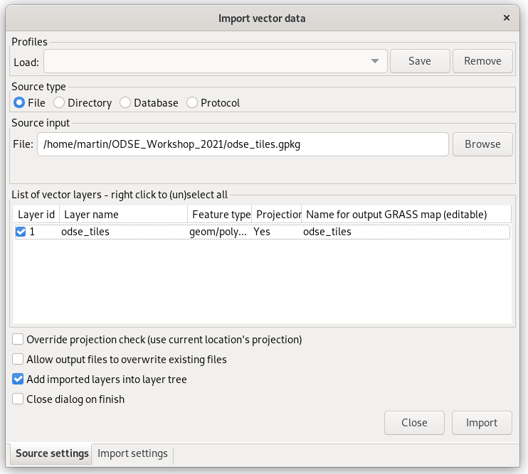

   Select input vector file to be imported.
   
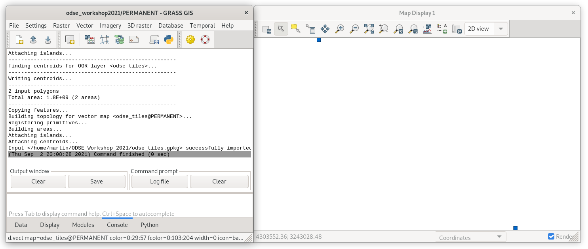
           
   Imported vector data is automatically displayed in the *Map Display*
   window. Progress of import is shown in the :item:`Console` tab.

.. _copy-map:

Let's copy the world map from the default location into the current location 
for a better feeling of where tiles are geographically located.

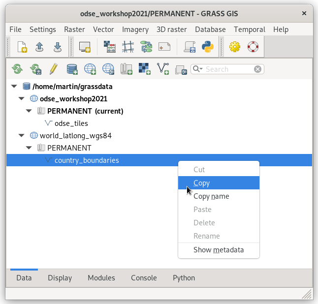
               
   Expand *world_latlong_wgs84* location and select
   *country_boundaries* vector map.

.. figure:: ../images/units/03/copy-1.png

   Select the current location and mapset and paste the selected
   data.

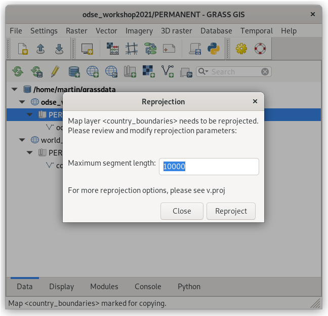

   Coordinate reference systems of source (:epsg:`4326`) and target
   (:epsg:`3035`) locations are different. GRASS will re-project
   data. Let's keep the default value for the maximum segment length (10km).

To display copied vector data go to the :item:`Data` tab, choose
the layer to be displayed and from the contextual menu choose
:item:`Display layer` (or use double-click on the layer).
   
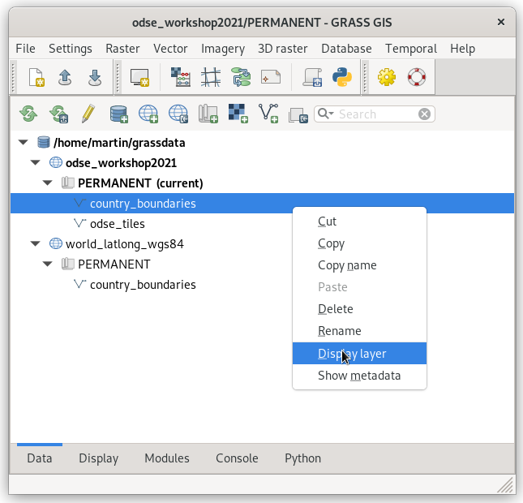

   Display layer from Data tab.
   
After displaying data, go to the :item:`Display` tab and re-order
layers. From the contextual menu choose :item:`Properties` (or use
double-click on layer).

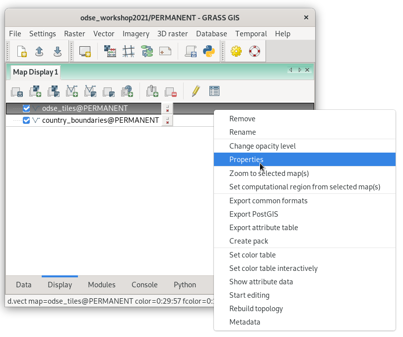

   Open layer properties dialog.

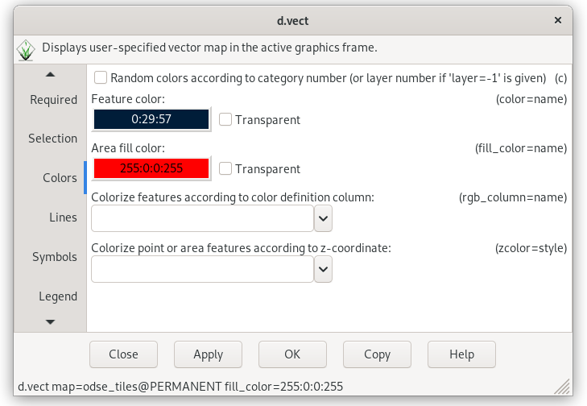

   Select fill color.

.. figure:: ../images/units/03/odse_tiles_countries.png
   :class: large

   Final map composition.

Raster data
-----------

Let's import sample ODSE tiles (:file:`dtm_5606.tif`) raster data
from the toolbar |grass-raster-import| :sup:`Import raster data
[r.import]`.

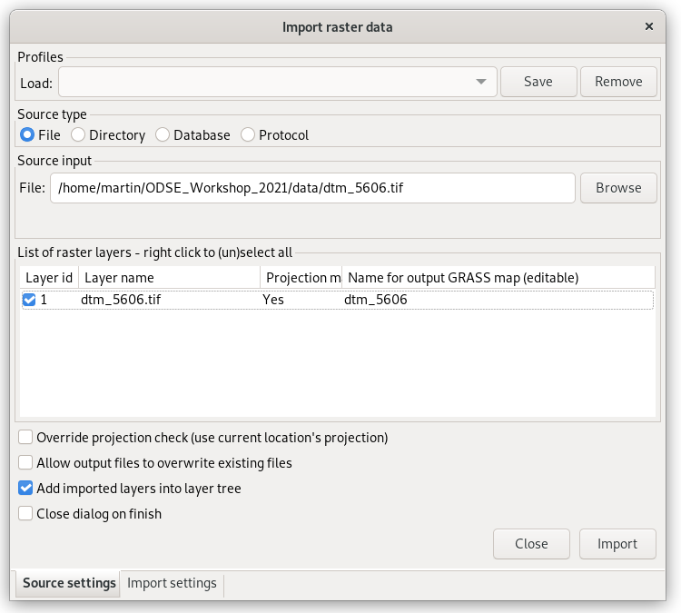

   Select input raster file to be imported.
   
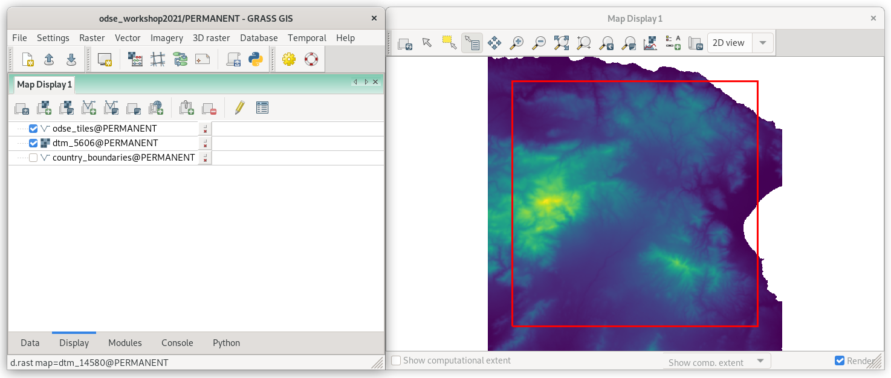
           
   Imported raster data is automatically displayed in the *Map Display*
   window. Progress of import is shown in the :item:`Console` tab.
   The default color table is not perfect as you can see, but color
   interpretation will be enhanced in :ref:`Unit 04 <color-table>`.

.. _raster-metadata:
  
Basic raster metadata can be printed using :grasscmd:`r.info` or from
the Layer Manager.

.. figure:: ../images/units/03/raster-metadata.png

   Show raster metadata from the contextual menu.

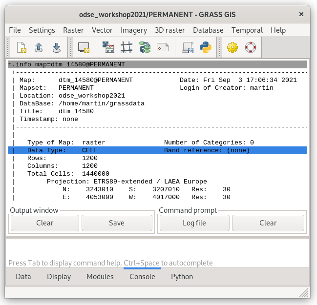

   Detail of raster metadata.

Raster maps are represented by a regular grid. Three data types are
supported:

* CELL (integer)
* FCELL (float)
* DCELL (double)

Notes
-----

   
.. important:: If the spatial reference system (SRS) of a raster file
   differs from that of the GRASS location (:item:`Project match`), the
   input raster data is automatically reprojected into the SRS of the 
   current GRASS location. Note that GRASS simply does not support on the
   fly transformation for several reasons.

.. _import-no-srs:

.. note:: In some cases, SRS of imported files can be missing or
   invalid. GRASS reports this issue as: *In case of no
   significant differences in the projection definitions, use
   the -o flag to ignore them and use current location
   definition. Consider generating a new location from the
   input dataset using the 'location' parameter.*

   GRASS allows importing such files by overriding project check
   (if you are really sure that SRS of the input file is the same
   as GRASS location).

.. _vector-topo-section:

Vector topology
~~~~~~~~~~~~~~~

Let's take a closer look at vector metadata of imported administrative
regions. Instead of "polygons" there are "areas" and other kinds of
primitives (points, lines, boundaries, centroids, islands), see
:numref:`vector-metadata`.

.. _vector-metadata:

.. figure:: ../images/units/03/vector-metadata-features.png

   Vector metadata of the imported file.

GRASS GIS is a **topological GIS**. Importing vector data into GRASS also
means converting features from the simple feature model (points,
linestrings, polygons, ...) into the GRASS topological model.

.. figure:: ../images/units/03/grass7-topo.png
   :class: middle
                    
   GRASS topological model with primitives (nodes, lines,
   boundaries, centroids, areas, and islands).
          
Topological errors are checked and repaired by GRASS GIS when
importing vector data, be aware of the :param:`snap` option in 
:grasscmd:`v.import` module. Topological errors impossible
to be repaired automatically without user specification can be fixed using
:grasscmd:`v.clean` module.

.. _link-external:

Linking external formats
~~~~~~~~~~~~~~~~~~~~~~~~

To avoid data duplication GRASS also allows linking raster data using
:grasscmd:`r.external` (*Link external raster data*) and vector data
by means of :grasscmd:`v.external` (*Link external vector data*).

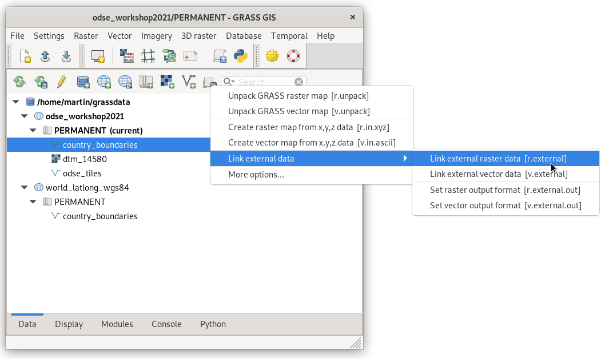
           
   Link raster or vector data.

Linking data is mainly recommended when working with raster data such as
large datasets of imagery data. GRASS can handle linked raster data
similarly to native raster maps, both in terms of stability and
accessibility.
