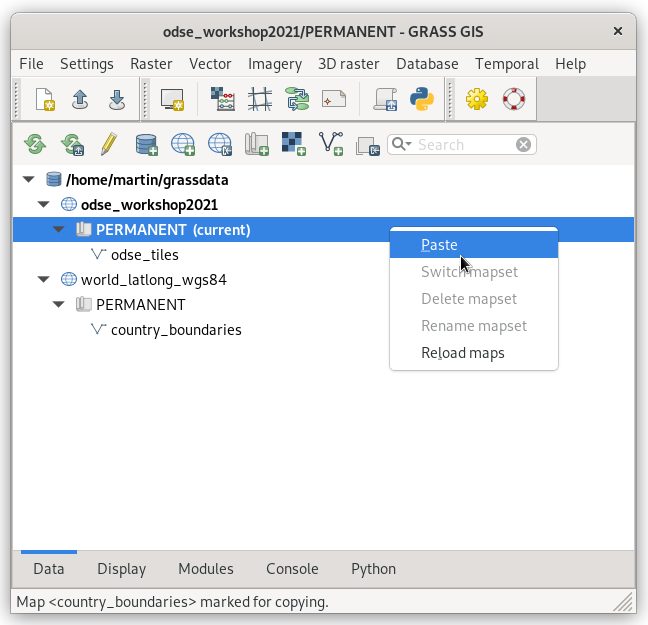
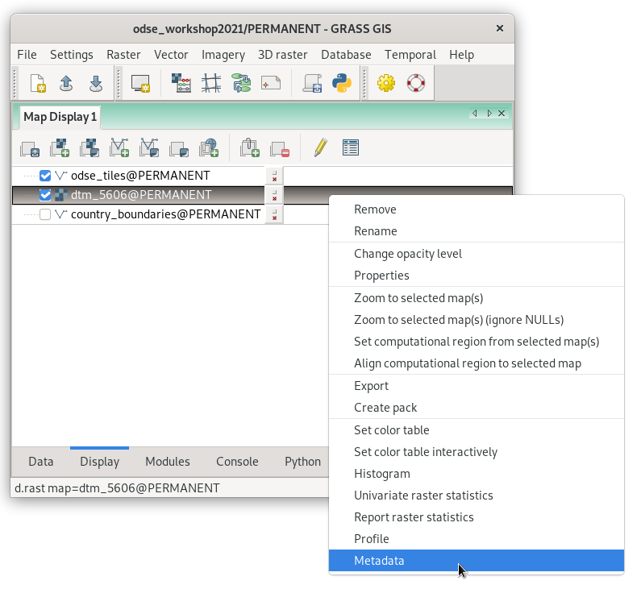
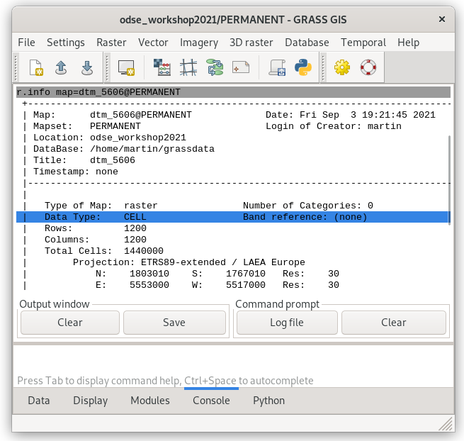

Data Management
===============

Data can be imported simply from toolbar in :item:`Data` tab by tools
dedicated for :wikipedia:`raster <GIS_file_formats#Raster>`
|grass-raster-import| or :wikipedia:`vector <GIS_file_formats#Vector>`
|grass-vector-import| GIS data formats. Basic knowledge of commonly
used :wikipedia:`GIS file formats` is required.

.. note:: GRASS terminology differs from commonly used GIS
   packages. To avoid confusion let's focus on the most
   important terms. Commonly used term "a layer" is called in
   GRASS "a map". While GRASS layer is a subset of features within
   one "map". So "GRASS raster map" can be treated as "a raster
   layer" in other GIS packages.

Vector data
-----------

Let's import sample ODSE tiles (:file:`odse_tiles.gpkg`) vector data
from the toolbar |grass-vector-import| :sup:`Import vector data
[v.import]`.

   Select input vector file to be imported.
   

           
   Imported vector data are automatically displayed in *Map Display*
   window. Progress of import is shown in :item:`Console` tab.

Let's copy into the current location a world map from default location
for better feeling.

               
   Expand *world_latlong_wgs84* location and select
   *country_boundaries* vector map.

   Select the currect location and mapset and paste already selected
   data.

.. figure:: ../images/units/02/copy-2.png

   Coordinate reference system of source (:epsg:`4326`) and target
   (:epsg:`3035`) location is different. GRASS will re-project
   data. Let's keep default value for maximum segment length (10km).

To display copied vector data go to :item:`Data` tab, choose
layer to be displayed and from contextual menu choose
:item:`Display layer` (or use double-click on layer).
   
.. figure:: ../images/units/02/display-layer.png

   Display layer from Data tab.
   
After displaying data go to :item:`Display` tab and re-order
layers. From contextual menu choose :item:`Properties` (or use
double-click on layer).

.. figure:: ../images/units/02/display-properties.png

   Open layer properties dialog.

.. figure:: ../images/units/02/d-vect-fill-color.png

   Select fill color.

.. figure:: ../images/units/02/odse_tiles_countries.png
   :class: large

   Final map composition.

Raster data
-----------

.. todo:: Update to DEM

Let's start with :file:`L2A_T32UPB_20170706T102021_B04_10m.jp2`
file. Sentinel's 4th band is a :wikipedia:`JPEG2000` file, which is
nowadays commonly used GIS *raster* format for imagery data.

.. figure:: ../images/units/03/import-raster-toolbar.png

   Import raster data from the main toolbar.

.. note:: Dialog for importing raster data is also accessible from
   menu :menuselection:`File --> Import raster data --> Simplified
   raster import with reprojection` or from command line by
   :grasscmd:`r.import` module.

Import dialog allows importing single raster file (:item:`File`) or
multiple files from directory (:item:`Directory`). In our case single
file is planned to be imported.

.. _import-raster:

.. figure:: ../images/units/03/import-raster-dialog.svg

   Dialog for importing raster file(s).

.. important:: If a spatial reference system (SRS) of raster file
   differs from GRASS location (:item:`Project match`) input raster
   data are automatically reprojected into SRS of a current GRASS
   location. Note that GRASS simply does not support on the fly
   transformation from several reasons.

.. _import-no-srs:

.. note:: In some cases SRS of imported file can be missing or
          invalid. GRASS reports this issue as *In case of no
          significant differences in the projection definitions, use
          the -o flag to ignore them and use current location
          definition.  Consider generating a new location from the
          input dataset using the 'location' parameter.*

          GRASS allows importing such file by overriding project check
          (if you are really sure that SRS of input file is the same
          as GRASS location).

After successful operation imported data layer should be automatically
displayed in Map Window.
          
.. figure:: ../images/units/03/display-band4.png
   :class: large

   Imported Sentinel band displayed in Map Window. Default grey color
   table is not perfect as you can see, color interpretation will
   enhanced in :ref:`Unit 04 <color-table>`.

.. note:: GRASS imports/links RGB image as separate bands. Color
   composition can be displayed using :grasscmd:`d.rgb`. By
   :grasscmd:`r.composite` it is possible to create color composite as
   a new raster map.
   
.. _raster-metadata:
  
Basic raster metadata can be printed by :grasscmd:`r.info` or from
Layer Manager.

   Display raster map metadata from Layer Manager.

   Raster metadata of imported file.

Raster maps are represented by regular grid. Three different data
types are supported:

* CELL (integer)
* FCELL (float)
* DCELL (double)

Notes
-----

.. _vector-topo-section:

Vector topology
~~~~~~~~~~~~~~~

Let's take a closer look at vector metadata of imported administrative
regions. Instead of "polygons" there are "areas" and other kind of
primitives (points, lines, boundaries, centroids, isles), see
:numref:`vector-metadata`.

.. _vector-metadata:

.. figure:: ../images/units/03/vector-metadata-features.png

   Vector metadata of imported file.

GRASS GIS is a **topological GIS**. Importing vector data into GRASS also
means converting features from simple feature model (points,
linestrings, polygons, ...) into GRASS topological model.

.. figure:: ../images/units/03/grass7-topo.png
   :class: middle
                    
   GRASS topological model with primitives (nodes, lines,
   boundaries, centroids, areas, and isles).
          
Topological errors are checked and repaired by GRASS GIS when
importing data, be awere of :param:`snap` option of
:grasscmd:`v.import` module. Topological errors which is not possible
repair automatically without user specification can fixed using
:grasscmd:`v.clean` module.

.. _link-external:

Linking external formats
~~~~~~~~~~~~~~~~~~~~~~~~

To avoid data duplication GRASS also allows linking raster data using
:grasscmd:`r.external` (*Link external raster data*) and vector data
by :grasscmd:`v.external` (*Link external vector data*).

.. figure:: ../images/units/03/link-data-menu.png

   Link raster or vector data from Layer Manager.

Linking data is mainly recommended when working with raster data such
large datasets of imagery data. GRASS can handle linked raster data
similarly as native raster maps. Both from point of stability and
accessibility.

GUI dialog for data linking is the same as for import, see
:numref:`import-raster`. Let's create a link to 8th Sentinel band JP2
file
:file:`geodata/sentinel/sample/L2A_T32UPB_20170706T102021_B08_10m.jp2`.

From metadata it is clear than 4th band was imported into native GRASS
format, while 8th band was linked directly from original JPEG2000
format.

.. figure:: ../images/units/03/raster-linked.png

   Linked raster file in external format by :grasscmd:`r.external`.

.. figure:: ../images/units/03/raster-imported.png

   Imported raster file in native GRASS format by
   :grasscmd:`r.in.gdal` (or :grasscmd:`r.import`).
