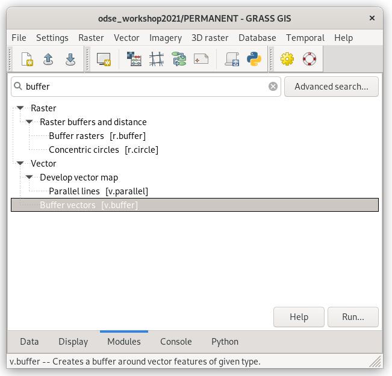
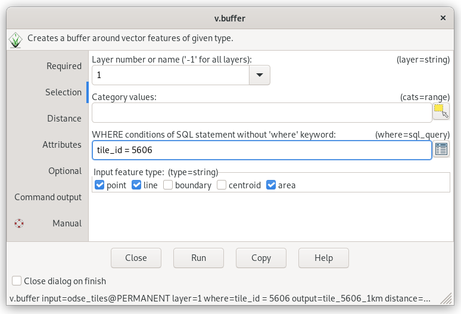
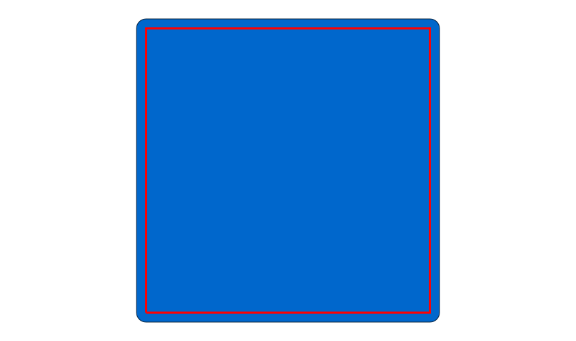
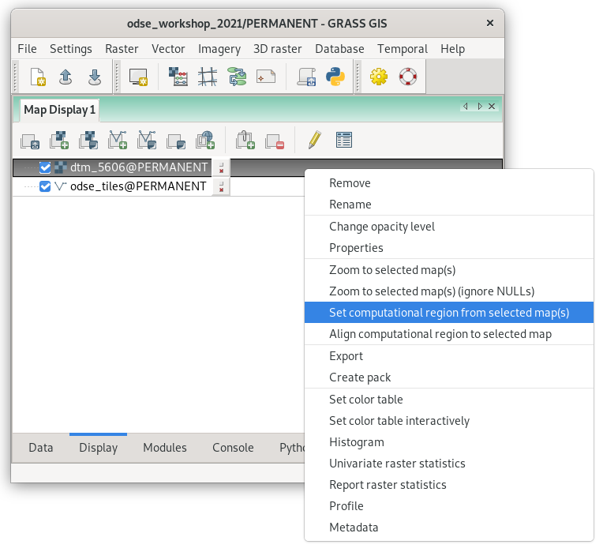
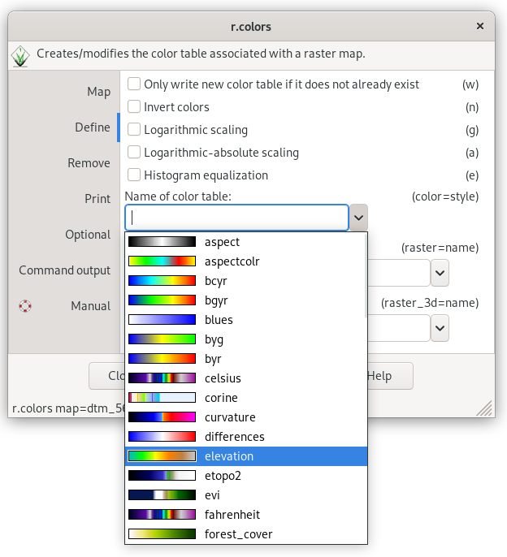
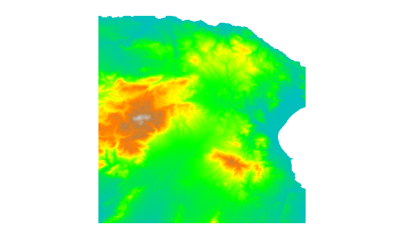

[Part 1] Modules, Region
========================

.. _grass-modules:

Accessing GRASS modules
-----------------------

GRASS GIS is a **modular system** that consists of several hundred
*tools* called "modules". Modules are accessible from the Layer
Manager menu, :item:`Modules` tab, or from the command prompt
(:item:`Console` tab).

Let's find a tool that creates a 1km *buffer* around the selected tile.

   Searching modules in the Layer Manager by 'buffer' keyword. The module
   which we are looking for is :grasscmd:`v.buffer`. Module dialog can
   be open by the :item:`Run` button.
   
.. note::

   .. figure:: ../images/units/04/modules-cmd.png

      Launching :grasscmd:`v.buffer` module from Layer Manager console.

..
   The commands (modules) can be called using GUI dialogs, from command
   line (:item:`Console` or "real" terminal), or through the Python API (see
   :doc:`10`). The figure bellow shows the GUI dialog of :grasscmd:`v.buffer`
   module.

.. _v-buffer:

                    
   GUI dialog for launching :grasscmd:`v.buffer` module.

.. tip:: CLI syntax of modules is shown in the GUI dialog status bar, see
   :numref:`v-buffer`. The command can be copied to the clipboard by the
   :item:`Copy` button for later usage.

The corresponding command for the console would be:

.. code-block:: bash

   v.buffer input=odse_tiles layer=1 where="tile_id = 5606" output=tile_5606_1km distance=1000

   Buffer of 1km around selected tile.

Each GRASS command starts with a prefix. This prefix groups modules into
several sections, see table below.
  
.. cssclass:: border

+----------+--------------------------------+-----------------------------------------------+
| prefix   | section                        | description                                   |
+==========+================================+===============================================+
| ``db.``  | :grasscmd:`database`           | attribute data management                     |
+----------+--------------------------------+-----------------------------------------------+
| ``d.``   | :grasscmd:`display`            | display commands                              |
+----------+--------------------------------+-----------------------------------------------+
| ``g.``   | :grasscmd:`general`            | generic commands                              |
+----------+--------------------------------+-----------------------------------------------+
| ``i.``   | :grasscmd:`imagery`            | imagery data processing                       |
+----------+--------------------------------+-----------------------------------------------+
| ``ps.``  | :grasscmd:`postscript`         | map outputs                                   |
+----------+--------------------------------+-----------------------------------------------+
| ``r.``   | :grasscmd:`raster`             | 2D raster data processing                     |
+----------+--------------------------------+-----------------------------------------------+
| ``r3.``  | :grasscmd:`raster3D`           | 3D raster data processing                     |
+----------+--------------------------------+-----------------------------------------------+
| ``t.``   | :grasscmd:`temporal`           | Temporal data processing                      |
+----------+--------------------------------+-----------------------------------------------+
| ``v.``   | :grasscmd:`vector`             | 2D/3D vector data processing                  |
+----------+--------------------------------+-----------------------------------------------+
 
.. _region:

Computational region
--------------------

The computational region is a **key element** in GRASS raster
processing. Unlike other GIS software such as Esri ArcGIS which sets
the computational region based on input data, GRASS is leaving this
operation to the user.

.. important:: **The user must define computational region before any
   raster computation is performed!**

The computational region is defined by *extent* (north, south, east, west)
and by *spatial resolution* in both directions (east-west,
north-south). Note that GRASS supports only regular grids.

.. figure:: ../images/units/04/region2d.png
              
   2D computational region grid.

.. note:: For 3D raster data (known as "volumes") there is an
   extension to the 3D computation grid.

The great majority of raster processing modules (``r.*``) respect the 
computational region. There are a few exceptions like import modules
(eg. :grasscmd:`r.import`). On the other hand, most vector
processing modules (``v.*``) ignore the computational region completely
since there is no computation grid defined for them.

The computational region can be easily set on existing raster or vector
map from Layer Manager.

   Set computational region from raster map.

Note that when setting up the computational region from a vector map, only
the extent is adjusted. It's a good idea to align the computational grid
based on the raster map used for computation (*Align computational region
to selected map*).
          
.. note:: Computation region extent is visualized in the map display as
   a red rectangle.

Full flexibility for operating with computational region is allowed via the 
:grasscmd:`g.region` module (:menuselection:`Settings --> Computational
region --> Set region`). Example below:

.. _aoi:
   
.. code-block:: bash

   g.region vector=tile_5606_1km align=dtm_5606
          
.. _color-table:

Color table
-----------

The color table of raster maps can be changed by the :grasscmd:`r.colors` command. 
Let's set the color for the raster map :map:`dtm_5606` to the *elevation* color table
suitable for digital terrain models.

The color table can be also easily set from the GUI in the :item:`Display` tab.

.. figure:: ../images/units/04/r-colors-menu.png
   
   Set color table from contextual menu.

.. code-block:: bash

   r.colors map=dtm_5606 color=grey.eq
            

   Choose the predefined 'elevation' color table in the :item:`Define` tab.
   

   
   DTM with the elevation color table.
