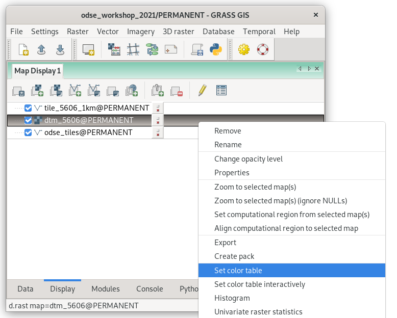

[Part 1] Modules, Region
========================

.. _grass-modules:

Accessing GRASS modules
-----------------------

GRASS GIS is a **modular system** that consists of several hundred
*tools* (called "modules"). Modules are accessible from the Layer
Manager menu, :item:`Modules` tab, or from the command prompt
(:item:`Console` tab).

Let's find a tool that creates a 1km *buffer* around the selected tile.

.. figure:: ../images/units/04/modules-tab.png

   Searching module in Layer Manager by 'buffer' keyword. The module
   which we are looking for is :grasscmd:`v.buffer`. Module dialog can
   be open by the :item:`Run` button.
   
.. note::

   .. figure:: ../images/units/04/modules-cmd.png

      Launching :grasscmd:`v.clip` module from Layer Manager console.

..
   The commands (modules) can be called using GUI dialogs, from command
   line (:item:`Console` or "real" terminal), or by using Python API (see
   :doc:`10`). Figure bellow shows GUI dialog of :grasscmd:`v.clip`
   module.

.. _v-buffer:

.. figure:: ../images/units/04/v-buffer.png
   :class: middle
                    
   GUI dialog for launching :grasscmd:`v.buffer` module.

.. tip:: CLI syntax of modules is shown in the GUI dialog status bar, see
   :numref:`v-buffer`. The command can be copied to the clipboard by the
   :item:`Copy` button for later usage.

The corresponding command for console would be:

.. code-block:: bash

   v.buffer input=odse_tiles layer=1 where="tile_id = 5606" output=tile_5606_1km distance=1000

.. figure:: ../images/units/04/tile_1km.png

   Buffer of 1km around selected tile.

Each GRASS command starts with a prefix. This prefix groups modules into
several sections, see table below.
  
.. cssclass:: border

+----------+--------------------------------+-----------------------------------------------+
| prefix   | section                        | description                                   |
+==========+================================+===============================================+
| ``db.``  | :grasscmd:`database`           | attribute data management                     |
+----------+--------------------------------+-----------------------------------------------+
| ``d.``   | :grasscmd:`display`            | display commands                              |
+----------+--------------------------------+-----------------------------------------------+
| ``g.``   | :grasscmd:`general`            | generic commands                              |
+----------+--------------------------------+-----------------------------------------------+
| ``i.``   | :grasscmd:`imagery`            | imagery data processing                       |
+----------+--------------------------------+-----------------------------------------------+
| ``ps.``  | :grasscmd:`postscript`         | map outputs                                   |
+----------+--------------------------------+-----------------------------------------------+
| ``r.``   | :grasscmd:`raster`             | 2D raster data processing                     |
+----------+--------------------------------+-----------------------------------------------+
| ``r3.``  | :grasscmd:`raster3D`           | 3D raster data processing                     |
+----------+--------------------------------+-----------------------------------------------+
| ``t.``   | :grasscmd:`temporal`           | Temporal data processing                      |
+----------+--------------------------------+-----------------------------------------------+
| ``v.``   | :grasscmd:`vector`             | 2D/3D vector data processing                  |
+----------+--------------------------------+-----------------------------------------------+
 
.. _region:

Computational region
--------------------

The computation region is a **key issue** in GRASS raster
processing. Unlike GIS software like Esri ArcGIS which sets
computation region based on input data, GRASS is leaving this
operation to the user.

.. important:: **The user must define computation region before any
   raster computation is performed!**

Computational region is defined by *extent* (north, south, east, west)
and by *spatial resolution* in both directions (east-west,
north-south). Note that GRASS supports only regular grids.

.. figure:: ../images/units/04/region2d.png
              
   2D computation region grid.

.. note:: For 3D raster data (known as "volumes") there is an
   extension to the 3D computation grid.

The majority of raster processing GRASS modules (``r.*``) respect
computational region, there are a few exceptions like import modules
(eg. :grasscmd:`r.import`). On the other hand, most vector
processing modules (``v.*``) ignore the computation region completely
since there is no computation grid defined by them.

The computational region can be easily set on existing raster or vector
map from Layer Manager.

.. figure:: ../images/units/04/comp-region-raster.png

   Set computational region from raster map.

Note that when setting up the computational region from vector map, only
the extent is adjusted. It's a good idea to align the computational grid
based on the raster map used for computation (*Align computational region
to selected map*).
          
.. note:: Computation region extent is visualized in map display by
   the red rectangle.

Full flexibility for operating with computation region allows
:grasscmd:`g.region` module (:menuselection:`Settings --> Computational
region --> Set region`). Example below:

.. _aoi:
   
.. code-block:: bash

   g.region vector=tile_5606_1km align=dtm_5606
          
.. _color-table:

Color table
-----------

The color table can be changed by the :grasscmd:`r.colors` command. Let's set
the color for raster map :map:`dtm_5606` to the *elevation* color table
suitable for digital terrain models.

The color table can be also easily set from the GUI in the :item:`Display` tab.

   
   Set color table from contextual menu.

.. code-block:: bash

   r.colors map=dtm_5606 color=grey.eq
            
.. figure:: ../images/units/04/r-colors.png

   Choose the predefined 'elevation' color table in the :item:`Define` tab.
   
.. figure:: ../images/units/04/colors-changed.png
   :class: large
   
   DTM with the elevation color table.
