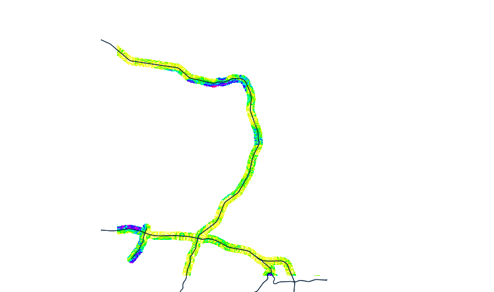

[Part 1] Raster processing
==========================

Raster data processing is always limited to the current
:ref:`computational region <region>`. Let's demonstrate it on
computing univariate statistics by :grasscmd:`r.univar` module.

.. figure:: ../images/units/05/r-univar-menu.png

   Computing univariate statistics from contextual menu.
   
.. code-block:: bash

   r.univar map=dtm_5606

The module computes statistics from input data located in the current
computational region.

::

   total null and non-null cells: 1140624
   total null cells: 44491

   Of the non-null cells:
   ----------------------
   n: 1096133
   minimum: 0
   maximum: 1395

Let's change the computational region interactively from the Map Display.

.. figure:: ../images/units/05/set-region-interactively.png

   Set the computational region extent interactively.

::

   total null and non-null cells: 76000
   total null cells: 0
   Of the non-null cells:
   ----------------------
   n: 76000
   minimum: 181
   maximum: 1347   

Computing DTM derivates
-----------------------

Let's set up the computational region back to our :ref:`area of interest
<aoi>`. Computation of slope or aspect from DTM is a well known
"discipline" in GIS. This functionality is provided in GRASS GIS by
:grasscmd:`r.slope.aspect`. Besides slope or aspect, the tool can also
compute curvatures and partial derivatives.

.. code-block:: bash

   r.slope.aspect elevation=dtm_5606 slope=slope_aoi aspect=aspect_aoi

           
   Slope computed from DTM in the current computational region. Simple
   legend can be added to map display by |grass-overlay-add| :sup:`Add
   map elements` (*Add raster legend*) from Map Display toolbar.

Working with a mask
-------------------

Raster mask can be created by :grasscmd:`r.mask`. Like other modules
from ``r.*`` family, it operates in the current computational region.

Let's create a mask defined by a 10km buffer around highways. The highways
data :file:`highways.gpkg` can be imported similarly as explained in
:doc:`03`.

.. note:: CRS of highways (:epsg:`4326`) differs from location CRS
   (:epsg:`3035`). It means that GRASS will perform reproject data
   into location CRS.

   .. figure:: ../images/units/05/re-project.png
           
      GRASS will reproject input data into location CRS.

.. code-block:: bash

   v.buffer input=highways output=highways_500m distance=500
   r.mask vector=highways_500m

           
   Mask applied.
          
.. note:: A mask can be removed by ``r.mask -r``.

Map algebra
-----------

The key GRASS module that allows a user to do the map algebra is
:grasscmd:`r.mapcalc`. A GUI tool for map algebra can be launched from
:menuselection:`Raster --> Raster map calculator` or by
|grass-raster-calculator| :sup:`Raster map calculator` from the main
toolbar.

           
   GUI map algebra tool.

Corresponding command:

.. code-block:: bash

   r.mapcalc expression="dtm_slope = if(dtm_5606 > 500 && slope_aoi > 10, dtm_5606)"

.. figure:: ../images/units/05/r-mapcalc-result.png
   :class: middle
           
   Result of map algebra command.

Automatization
--------------

Graphical Modeler
~~~~~~~~~~~~~~~~~

**Graphical Modeler** allows creating, editing, and managing complex
models in an easy-to-use graphical user interface. Using Graphical
Modeler, a chain of tools (ie. GRASS modules) can be wrapped
into one process (a model). A model can be executed repeatedly with
slightly different inputs or parameters.

.. todo:: model

v.extract input=odse_tiles output=tile where="tile_id = 5606"
g.region vector=tile align=dtm
r.slope.aspect input=dtm slope=slope_tile
r.univar map=slope_tile

Example of Python script
~~~~~~~~~~~~~~~~~~~~~~~~

.. code-block:: bash

   slope_aoi.py tile_id=5606 elevation=dtm elevation_threshold=1000

   slope_aoi.py tile_id=5606 elevation=dtm
   
.. todo:: write script
