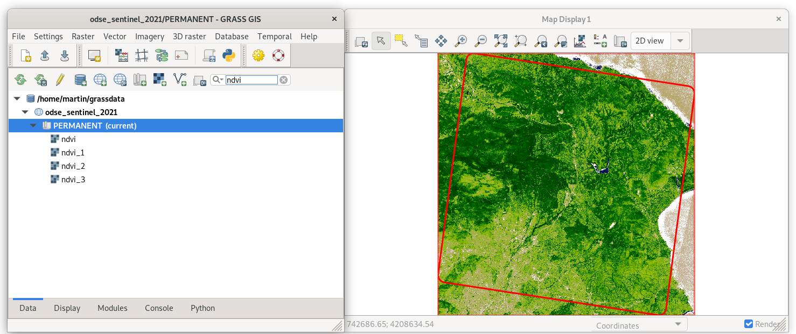
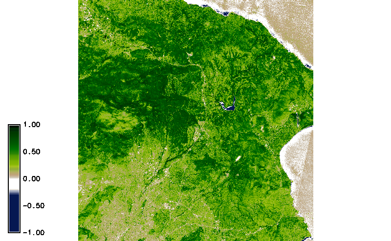
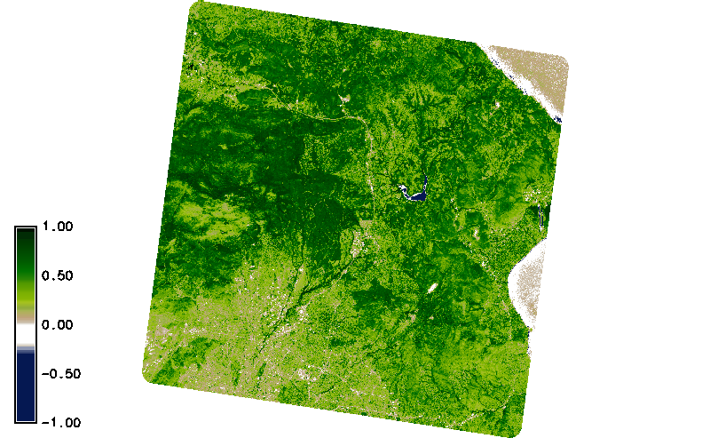

[Part 2] Time series data processing
====================================

GRASS GIS offers specialized tools for spatio-temporal data
processing, see :grasscmd:`GRASS documentation <temporalintro>` for
details.

GRASS introduces three special data types that are designed to handle
time-series data:

* *Space-time raster datasets* (``strds``) for managing raster map
  time series.
* *Space-time 3D raster datasets* (``str3ds``) for managing 3D raster
  map time series.
* *Space-time vector datasets* (``stvds``) for managing vector map time
  series.

Create space-time dataset
-------------------------

At this moment a new space-time dataset can be created by means of
:grasscmd:`t.create` and all imported Sentinel bands registered with
:grasscmd:`t.register`.

.. code-block:: bash

   t.create output=s2_tile_5606 title="Sentinel L2A 2021" desc="Tile 5606"
   t.register input=s2_tile_5606 file=/home/odse/sentinel-timestamps.txt

Let's check basic metadata (:grasscmd:`t.info`) and list the registered
maps (:grasscmd:`t.rast.list`).

.. code-block:: bash

   t.info input=s2_tile_5606

::

   ...
   | Start time:................. 2021-06-24 09:19:52.607078
   | End time:................... 2021-08-28 09:19:49.080855
   ...
   | Number of registered maps:.. 6

.. code-block:: bash

   t.rast.list input=s2_tile_5606

::

   name|mapset|start_time|end_time
   T34SGH_20210624T090601_B04_20m|PERMANENT|2021-06-24 09:19:52.607078|None
   T34SGH_20210624T090601_B8A_20m|PERMANENT|2021-06-24 09:19:52.607078|None
   T34SGH_20210729T090559_B04_20m|PERMANENT|2021-07-29 09:19:53.186492|None
   T34SGH_20210729T090559_B8A_20m|PERMANENT|2021-07-29 09:19:53.186492|None
   T34SGH_20210828T090549_B04_20m|PERMANENT|2021-08-28 09:19:49.080855|None
   T34SGH_20210828T090549_B8A_20m|PERMANENT|2021-08-28 09:19:49.080855|None

NDVI ST computation
-------------------

For NDVI computation 4th and 8th bands are required (:doc:`06`). Map
algebra for spatio-temporal data is performed by :grasscmd:`t.rast.algebra`
which requires bands separated into different
spatio-temporal datasets (see example in :doc:`22`). Such datasets can
be prepared by :grasscmd:`t.rast.extract`.

.. code-block:: bash

   t.rast.extract input=s2_tile_5606 where="name like '%B04%'" output=s2_b4
   t.rast.extract input=s2_tile_5606 where="name like '%B8A%'" output=s2_b8

Let's check content of the new datasets by :grasscmd:`t.rast.list`.

.. code-block:: bash

   t.rast.list input=s2_b4
   t.rast.list input=s2_b8

..
   Set computational region by :grasscmd:`g.region` including mask for the
   area of interest by :grasscmd:`r.mask`.

   .. code-block:: bash

      g.region vector=jena_boundary align=T32UPB_20190407T102021_B04_10m
      r.mask vector=jena_boundary

NDVI (see :doc:`06`) computation on spatio-temporal datasets can be
performed in parallel (:param:`nproc`).
          
.. code-block:: bash

   t.rast.algebra basename=ndvi expression="ndvi = float(s2_b8 - s2_b4) / ( s2_b8 + s2_b4 )" 

.. tip:: GRASS 8 adds support for band references (see
   :grasscmd:`g.bands` for details). NDVI can be computed directly
   using :map:`s2_tile_5606` space-time dataset. No need for creating
   time series subsets as described above.

   .. code-block:: bash
                   
      t.rast.mapcalc inputs=s2_tile_5606.S2_8A,s2_tile_5606.S2_4 output=ndvi basename=ndvi \
      expression="float(s2_tile_5606.S2_8A - s2_tile_5606.S2_4) / (s2_tile_5606.S2_8A + s2_tile_5606.S2_4)"

When computation is finished *ndvi* color table can be set with
:grasscmd:`t.rast.colors`.

.. code-block:: bash

   t.rast.colors input=ndvi color=ndvi

   Filtering NDVI products by name within the :item:`Data` tab.
   

   Simple NDVI animation (no clouds mask applied) created by
   :grasscmd:`g.gui.animation`.

Cloud mask
^^^^^^^^^^

Let's apply the cloud masks on our NDVI space-time dataset. At first, we will create
a new space-time dataset containing computed raster masks. A sample
Python script has been designed for this purpose below. Masks can
be created with :grasscmd:`r.mask`, see line :lcode:`30`. But in this
case, the mask should be kept for further usage. Note that
:grasscmd:`r.mask` module produces a normal raster map with the unique name
*MASK*. To disable a mask, it is enough to rename the *MASK* map with
:grasscmd:`g.rename`, see line :lcode:`43`.

.. literalinclude:: ../_static/scripts/sentinel-cloud-mask.py
   :language: python
   :linenos:
   :emphasize-lines: 30, 43

Sample script to download: `sentinel-cloud-mask.py
<../_static/scripts/sentinel-cloud-mask.py>`__
	     
.. code-block:: bash
		
   sentinel-cloud-mask.py map=tile_5606_1km input=s2_b4 output=cloud-timestamps.txt

Now we can create a new space-time dataset and register the raster cloud masks
created before.

.. code-block:: bash

   t.create output=clouds title="Cloud mask Sentinel L2A 2021" desc="Tile 5606"
   t.register input=clouds file=cloud-timestamps.txt

Let's check maps registered in the new space-time dataset.

.. code-block:: bash

   t.rast.list clouds

::

   name|mapset|start_time|end_time
   T34SGH_20210624T090601_MSK_CLOUDS_tile_5606_1km|PERMANENT|2021-06-24 09:19:52.607078|None
   T34SGH_20210729T090559_MSK_CLOUDS_tile_5606_1km|PERMANENT|2021-07-29 09:19:53.186492|None
   T34SGH_20210828T090549_MSK_CLOUDS_tile_5606_1km|PERMANENT|2021-08-28 09:19:49.080855|None
                
We now apply the cloud masks map by map using :grasscmd:`t.rast.algebra` and set 
*ndvi* color table.

.. code-block:: bash

   t.rast.algebra basename=ndvi_masked_1 nprocs=3 \
   expression="ndvi_masked_1 = if(isnull(clouds), null(), float(s2_b8 - s2_b4) / ( s2_b8 + s2_b4 ))"

   t.rast.colors input=ndvi_masked color=ndvi

                    
   Simple NDVI animation with clouds masks applied. Computation is limited
   to AOI only.
