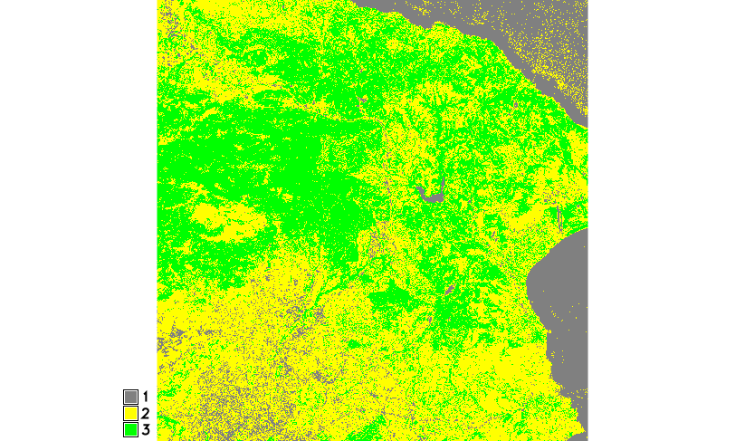
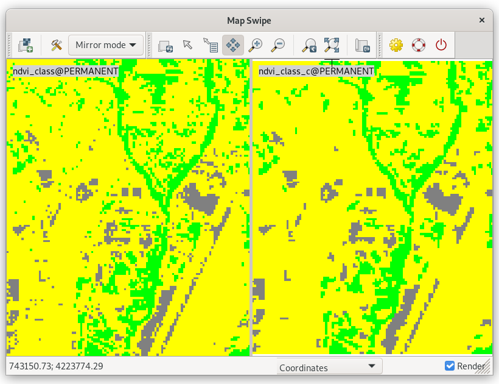

[Part 2] Temporal Framework Python API
======================================

GRASS offers a Python API for :grasscmd2:`space-time processing
<libpython/temporal_framework.html>`. The usage is presented in the
script described below.

NDVI values range from +1.0 to -1.0. Areas of barren rock, sand, or
snow usually show very low NDVI values (for example, 0.1 or
less). Sparse vegetation such as shrubs and grasslands or senescing
crops may result in moderate NDVI values (approximately 0.1 to
0.5). High NDVI values (approximately 0.5 to 1.0) correspond to dense
vegetation such as that found in temperate and tropical forests or
crops at their peak growth stage. Let's classify NDVI into 3 major
classes:

* Class 1: from -1.0 to 0.1
* Class 2: from 0.1 to 0.5
* Class 3: from 0.5 to 1.0

The desired output will be a vector map with NDVI classes. Let's also
eliminate small areas.

Workflow
--------

#. Set computational region based on modified input region (:grasscmd:`g.region`)
#. Compute NDVI values (:grasscmd:`i.vi`)
#. Reclassify NDVI values into classes (:grasscmd:`r.recode`)
#. Remove small areas (join them with adjacent areas by
   :grasscmd:`r.reclass.area` and :grasscmd:`r.grow.distance`)
#. Set a reasonable color table for raster map classes (:grasscmd:`r.colors`)

Overview of corresponding commands:

.. code-block:: bash

   g.region vector=tile_5606_1km align=T34SGH_20210624T090601_B04_20m
   i.vi red=T34SGH_20210624T090601_B04_20m output=ndvi nir=T34SGH_20210624T090601_B8A_20m
   r.recode input=ndvi output=ndvi_class rules=reclass.txt
   r.colors map=ndvi_class rules=colors.txt
   r.reclass.area input=ndvi_class output=ndvi_class2 mode=greater value=0.12
   r.grow.distance input=ndvi_class2 value=ndvi_class_c
   r.colors map=ndvi_class_c raster=ndvi_class

Example of `reclass.txt <../_static/scripts/reclass.txt>`__ and
`colors.txt <../_static/scripts/colors.txt>`__ files.

           
   Example of reclassified NDVI.

           
   Comparisson of NDVI classes before and after postprocessing
   (removing small areas) using :grasscmd:`g.gui.mapswipe`.
   
At the end, NDVI statistics for each class will be computed with
:grasscmd:`r.report`.

UI
--

Let's define input and output parameters of the script:

* :param:`b4` - Name of input 4th band space time raster dataset (line
  :lcode:`19`)
* :param:`b8` - Name of input 8th band space time raster dataset (line
  :lcode:`23`)
* :param:`clouds` - Name of the input mask (region+clouds) space time raster dataset
  (line :lcode:`27`)
* :param:`output` - Name for the output stats file (line :lcode:`30`)
* :param:`basename` - Basename for output raster maps (line
  :lcode:`33`)
* :param:`threshold` - Threshold for removing small areas (line
  :lcode:`38`)

Python Temporal API
-------------------

.. _temporal-api:

List on functions used from :grasscmd2:`GRASS GIS Temporal Framework
<libpython/temporal_framework.html>` Python API:

* initialization must be done by :grasscmd2:`init
  <libpython/temporal.html#temporal.core.init>` function, see line
  :lcode:`120`
* space time datasets are open on lines :lcode:`122-124` by
  :grasscmd2:`open_old_stds
  <libpython/temporal.html#temporal.open_stds.open_old_stds>`
* raster maps registered in reference dataset (b4) are listed on line
  :lcode:`128` by :grasscmd2:`get_registered_maps
  <libpython/temporal.html#temporal.abstract_space_time_dataset.AbstractSpaceTimeDataset.get_registered_maps>`
* related raster maps in two other datasets (b8, cl) are searched for on
  lines :lcode:`131-134` by :grasscmd2:`get_registered_maps
  <libpython/temporal.html#temporal.abstract_space_time_dataset.AbstractSpaceTimeDataset.get_registered_maps>`
  with ``where`` parameter

.. literalinclude:: ../_static/scripts/ndvi-tgrass.py
   :language: python
   :linenos:
   :emphasize-lines: 19, 23, 27, 30, 33, 38, 120, 122-124, 128, 131-134

Sample script to download: `ndvi-tgrass.py
<../_static/scripts/ndvi-tgrass.py>`__
      
Example of usage
----------------

.. code-block:: bash

   ndvi-tgrass.py b4=b4 b8=b8 mask=clouds basename=ndvi_c out=stats.txt

Possible output:

::

   --------------------------------------------------------------------------------
   NDVI class statistics (ndvi_c_1: 2021-06-24 09:19:52.607078)
   --------------------------------------------------------------------------------
   +-----------------------------------------------------------------------------+
   |                      Category Information                        |          |
   |#|description                                                     |  hectares|
   |-----------------------------------------------------------------------------|
   |1| . . . . . . . . . . . . . . . . . . . . . . . . . . . . . . . .|   6324.60|
   |2| . . . . . . . . . . . . . . . . . . . . . . . . . . . . . . . .| 51,718.48|
   |3| . . . . . . . . . . . . . . . . . . . . . . . . . . . . . . . .| 44,296.52|
   |-----------------------------------------------------------------------------|
   |TOTAL                                                             |102,339.60|
   +-----------------------------------------------------------------------------+
   --------------------------------------------------------------------------------
   NDVI class statistics (ndvi_c_2: 2021-07-29 09:19:53.186492)
   --------------------------------------------------------------------------------
   +-----------------------------------------------------------------------------+
   |                      Category Information                        |          |
   |#|description                                                     |  hectares|
   |-----------------------------------------------------------------------------|
   |1| . . . . . . . . . . . . . . . . . . . . . . . . . . . . . . . .|   5963.40|
   |2| . . . . . . . . . . . . . . . . . . . . . . . . . . . . . . . .| 56,585.04|
   |3| . . . . . . . . . . . . . . . . . . . . . . . . . . . . . . . .| 39,791.16|
   |-----------------------------------------------------------------------------|
   |TOTAL                                                             |102,339.60|
   +-----------------------------------------------------------------------------+
   --------------------------------------------------------------------------------
   NDVI class statistics (ndvi_c_3: 2021-08-28 09:19:49.080855)
   --------------------------------------------------------------------------------
   +-----------------------------------------------------------------------------+
   |                      Category Information                        |          |
   |#|description                                                     |  hectares|
   |-----------------------------------------------------------------------------|
   |1| . . . . . . . . . . . . . . . . . . . . . . . . . . . . . . . .|   5317.76|
   |2| . . . . . . . . . . . . . . . . . . . . . . . . . . . . . . . .| 60,821.44|
   |3| . . . . . . . . . . . . . . . . . . . . . . . . . . . . . . . .| 36,200.40|
   |-----------------------------------------------------------------------------|
   |TOTAL                                                             |102,339.60|
   +-----------------------------------------------------------------------------+
