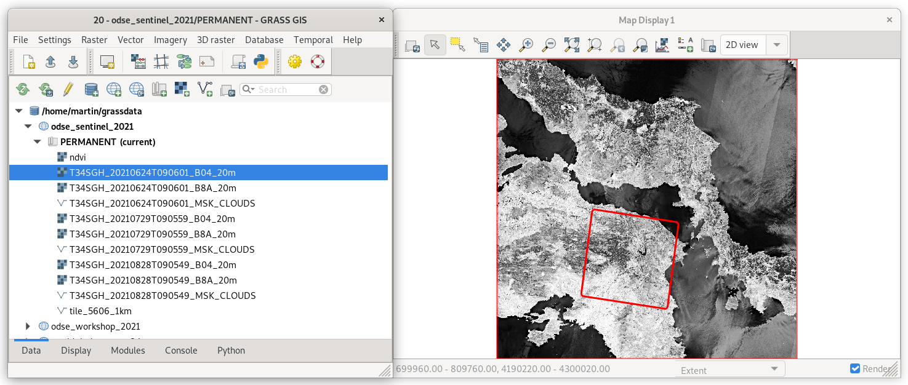

[Part 2] Accessing Sentinel EO data
===================================

There are plenty of libraries or tools which allows downloading
Sentinel products from `Copernicus Open Access Hub
<https://scihub.copernicus.eu/>`__.

For GRASS GIS there is available :grasscmdaddons:`i.sentinel` addon
extension. It consists of fours GRASS modules:

* :grasscmdaddons:`i.sentinel.download`
* :grasscmdaddons:`i.sentinel.import`
* :grasscmdaddons:`i.sentinel.preproc`
* :grasscmdaddons:`i.sentinel.mask`

.. todo:: Update list...

Addons modules can easily installed by :grasscmd:`g.extension`
(:menuselection:`Settings --> Addons extensions --> Install extension
from addons`).

.. figure:: ../images/units/20/g-extension.png

   Install :grasscmdaddons:`i.sentinel` GRASS Addon.

.. code-block:: bash

   g.extension extension=i.sentinel
   
Note that :grasscmdaddons:`i.sentinel.download` requires also
`sentinelsat library <https://pypi.python.org/pypi/sentinelsat>`__ to
be installed.

.. note:: Sentinelsat library can easily installed from
   :item:`Console` tab by entering command below.
   
   .. code-block:: bash
	
      python3 -m pip install sentinelsat

Download data
-------------

.. important:: Pre-downloaded Sentinel scenes are available in `sample
   dataset
   <https://geo.fsv.cvut.cz/geoharmonizer/odse_workshop_2021/t34sgh_20_60m.zip>`__. Participants
   can continue with :ref:`importing sample data <sentinel-import>`.

Let's download suitable Sentinel products for our area of interest
(AOI) and perform NDVI calculation. AOI region is defined by
:map:`tile_5606_1km` created in :doc:`05`.

`Sentinel-2 L2A products
<https://www.sentinel-hub.com/blog/sentinel-2-l2a-products-available-sentinel-hub>`__
will be used to avoid need of computing atmospheric corrections. Let's
search for latest available product by
:grasscmd:`i.sentinel.download`. By :param:`-l` flag, result will just
printed. Download procedure will be performed later. In order to
search and download Sentinel products, you have to create a user
account in Copernicus Open Access Hub, see manual page of
:grasscmd:`i.sentinel.download` module for details. Create a new text
file :file:`sentinel.txt` containing two lines (username and
password).

.. note::
   To get username and password you need to register to the 
   `Copernicus Open Access Hub <https://scihub.copernicus.eu/>`__,
   see `Register new account <https://scihub.copernicus.eu/dhus/#/self-registration>`__
   page for signing up.

.. code-block:: bash

   i.sentinel.download -l map=tile_5606_1km producttype=S2MSI2A settings=sentinel.txt

::

   24 Sentinel product(s) found
   99389c4b-65d8-40ce-b32b-91cd42dba4af ... 2021-07-29T09:05:59Z  0% S2MSI2A
   118b5ede-78d6-4ccf-8c7e-bd3b83f0a4e8 ... 2021-07-29T09:05:59Z  0% S2MSI2A
   dc2fcffa-da81-4bfe-bb99-88cc8dde1ea7 ... 2021-08-03T09:06:01Z  1% S2MSI2A
   ...

By default the module returns products for last 60 days. Let's change
search period by :param:`start` and :param:`end` options. We will also
limit products by :param:`clouds` coverage percentage threshold. Sort
product by sort ingestion date.
       
.. code-block:: bash
                
   i.sentinel.download -l map=tile_5606_1km producttype=S2MSI2A settings=sentinel.txt \
   start=2021-04-01 end=2021-08-31 clouds=5 sort=ingestiondate

::

   26 Sentinel product(s) found
   901763e0-f592-4eb8-8f51-036ee2fa5665 ... 2021-04-30T09:05:49Z  4% S2MSI2A
   ab66170a-f2d5-4d21-a0ce-5412a0043fd3 ... 2021-05-10T09:05:49Z  1% S2MSI2A
   431da3a0-56d2-452c-bb0f-8d05b55969a9 ... 2021-05-10T09:05:49Z  1% S2MSI2A
   ...
   
.. tip:: If more products have been found you can limit search by
   :param:`limit` option.

Let's download desired product(s). Just remove :param:`-l` flag and
add :param:`output` option in order to define path to output directory
where data should be saved.

.. code-block:: bash

   i.sentinel.download map=tile_5606_1km producttype=S2MSI2A settings=sentinel.txt \
   start=2021-04-01 end=2021-08-31 clouds=5 \
   output=/data/sentinel

Import data
-----------

.. _sentinel-import:

Before importing or linking Sentinel data try to print list of
filtered raster files including projection match (second column 1 for
match otherwise 0). If CRS of input data differs from current location
consider reprojection (:param:`-r`) or creating a new location for
import.

.. important:: To avoid re-projecting Sentinel data we will create a
   new location (see :ref:`create-location`) defined by :epsg:`32634`.

.. figure:: ../images/units/20/sentinel-new-loc.png

   New location *odse_sentinel_2021*.

Data will be imported into the new location by
:grasscmdaddons:`i.sentinel.import` tool. The command will import
**all** Sentinel bands from :param:`input` directory
recursively. Before importing data let's check content of the input
directory by :param:`-p` flag.

.. code-block:: bash
 
   i.sentinel.import -p input=/home/odse/Downloads/t34sgh_20_60m 

   ::

      .../R20m/T34SGH_20210828T090549_B03_20m.jp2 0 (EPSG: 32634)
      .../R20m/T34SGH_20210828T090549_B04_20m.jp2 0 (EPSG: 32634)
      .../R20m/T34SGH_20210828T090549_B8A_20m.jp2 0 (EPSG: 32634)
      ...
      
In example below import procedure will be limited to 4th and 8th bands
in 20m by :param:`pattern` option.

.. code-block:: bash
 
   i.sentinel.import -p input=/home/odse/Downloads/t34sgh_20_60m pattern="B(04|8A)_20m"

   ::

      .../R20m/T34SGH_20210828T090549_B8A_20m.jp2 0 (EPSG: 32634)
      .../R20m/T34SGH_20210828T090549_B04_20m.jp2 0 (EPSG: 32634)
      .../R20m/T34SGH_20210624T090601_B04_20m.jp2 0 (EPSG: 32634)
      .../R20m/T34SGH_20210624T090601_B8A_20m.jp2 0 (EPSG: 32634)
      .../R20m/T34SGH_20210729T090559_B04_20m.jp2 0 (EPSG: 32634)
      .../R20m/T34SGH_20210729T090559_B8A_20m.jp2 0 (EPSG: 32634)

By default input data are imported into GRASS data format,
alternatively data can be linked if :param:`-l` is given. It is also
useful to import cloud mask vector features by :param:`-c` flag.

.. code-block:: bash

   i.sentinel.import -l -c input=/home/odse/Downloads/t34sgh_20_60m pattern="B(04|8A)_20m"

Lets copy our AOI (:map:`tile_5606_1km`) from *odse_workshop_2021*
location as described in :ref:`copy-map`.

           
   Visualization of 4th band. :ref:`Color table <color-table>` set to
   ``grey.eq`` (don't forget to set up computational 
   
Computing NDVI
--------------

To compute :wikipedia:`NDVI`, the red (VIS) and near-infrared (NIR)
channels are required. In the case of Sentinel-2, it refers to 4th and
8th band.

.. math::
        
   NDVI = (NIR - VIS) / (NIR  + VIS)

Before computing let's set up computational region based on whole
Sentinel scene.

.. code-block:: bash

   g.region raster=T34SGH_20210624T090601_B04_20m

NDVI can be computed by :grasscmd:`i.vi` tool which allows computing
various vegetation indices.

.. code-block:: bash

   i.vi red=T34SGH_20210624T090601_B04_20m output=ndvi viname=ndvi nir=T34SGH_20210624T090601_B8A_20m

Let's mask cloudy areas by a mask created by
:grasscmdaddons:`i.sentinel.import`. Note that masking as other raster
processing is performed only within the current computation region,
see :doc:`04`.

..
   .. figure:: ../images/units/05/r-mask.png

      Creating mask from an input vector map.
   
.. code-block:: bash

   r.mask vector=T34SGH_20210624T090601_MSK_CLOUDS -i
   
.. figure:: ../images/units/20/ndvi-legend.png
   :class: middle
           
   Final NDVI product with cloud mask applied with a legend.
